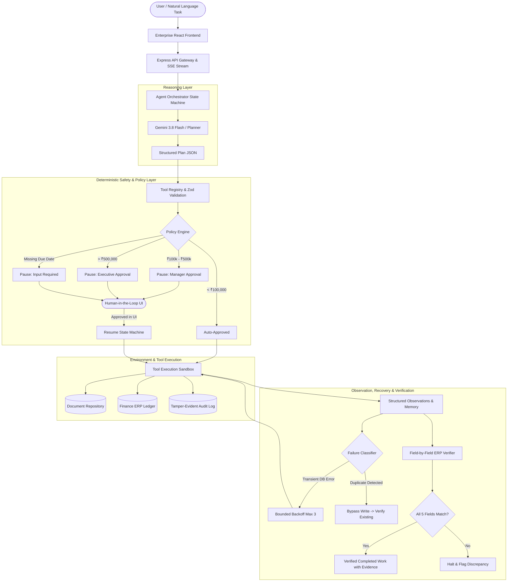

# Autonomous Finance Employee

> **Tagline:** An agent that turns a natural-language finance task into verified completed work.

Built for the **CentrAlign AI Engineering Hiring Assignment**.

---

## 1. Problem

Enterprise finance and accounts payable departments face significant operational friction. Workers repeatedly locate vendor invoices from document repositories or emails, extract financial data, check organizational spending policies, enter records into ERP systems, and manually verify that entries match invoices.

Existing automated solutions fail in two ways:
1. **Brittle RPA scripts** break whenever invoices differ slightly in format or order.
2. **Unconstrained AI Chatbots** hallucinate missing data (such as due dates), lack deterministic safety guardrails, cannot pause for human approval, and falsely claim completion without verifying actual ledger state.

---

## 2. Solution

The **Autonomous Finance Employee** is a production-oriented autonomous worker that accepts high-level natural language instructions, reasons through an explicit state machine, invokes validated tools against a simulated enterprise environment, handles errors with bounded exponential backoff, requests human sign-off when policies dictate, and **never claims completion without verifying persisted ledger state**.

---

## 3. Architecture



---

## 4. Core Agent Loop

```
GOAL → UNDERSTAND → PLAN → SELECT TOOLS → EXECUTE → OBSERVE → ADAPT → VERIFY → COMPLETE
```

1. **Understand**: Parses user intent, identifying target vendor, invoice numbers, and constraints.
2. **Plan**: Formulates a typed JSON plan decomposed into discrete tool steps.
3. **Select Tools**: Picks registered tools based on state and previous observations.
4. **Execute**: Validates arguments via Zod and executes within the environment sandbox.
5. **Observe**: Captures structured tool outputs into state memory.
6. **Adapt**: Adjusts the plan based on observations (e.g., detecting an existing record or missing field).
7. **Verify**: Queries the ledger independently and validates all 5 financial fields.
8. **Complete**: Emits an auditable completion summary containing verified evidence.

---

## 5. Why This Architecture?

| Responsibility | Handled By | Justification |
|:---|:---|:---|
| **Reasoning & Planning** | LLM (`gemini-3.8-flash`) | Natural language understanding, contextual intent parsing, dynamic tool selection. |
| **Safety & Invariants** | Deterministic Code (TypeScript) | Hard policy boundaries, permission models, Zod validation, bounded retries, authorization. |
| **State Transitions** | Explicit State Machine | Prevents uncontrolled prompt loops; enables deterministic pauses for human approval. |
| **Data Integrity** | Post-Write Verifier | Eliminates hallucinations; guarantees records exist in the database with matching fields. |

---

## 6. Tools

| Tool | Permission | Inputs | Side Effects | Description |
|:---|:---:|:---|:---:|:---|
| `search_invoices` | `READ` | `{ vendor?: string, limit?: number }` | None | Searches invoice document repository for vendor matches. |
| `get_invoice` | `READ` | `{ invoice_id: string }` | None | Retrieves raw invoice content and document metadata. |
| `extract_invoice_data` | `READ` | `{ invoice_id: string }` | None | Extracts structured financial fields (vendor, amount, due date, items). |
| `search_finance_records`| `READ` | `{ invoice_number?: string, vendor?: string }` | None | Queries ERP ledger to detect existing duplicate records. |
| `create_finance_record` | `WRITE` | `{ invoice_number, vendor, amount, currency, due_date, line_items_count? }` | Mutates ERP Ledger | Inserts invoice record into finance database. Enforces policy approval. |
| `get_finance_record` | `READ` | `{ record_id: string }` | None | Fetches ERP record by record ID (`FIN-...`) for independent post-write verification. |
| `request_human_approval`| `APPROVAL`| `{ reason, action, risk, details }` | Pauses State Machine | Emits approval request to UI; pauses execution until human acts. |

---

## 7. Human-in-the-Loop Policy

Financial approval thresholds are enforced deterministically by the `PolicyEngine` and configured in `CompanyMemory`:

- **< ₹100,000**: Automatically approved and entered into the ledger.
- **₹100,000 to ₹500,000**: Pauses for **Human Manager Approval** (Medium Risk).
- **> ₹500,000**: Pauses for **Executive Board Approval** (High Risk).
- **Missing Due Date**: Invoices missing due dates are **never** filled with hallucinated dates. The agent halts and requests human supervisor input.

When approval is required:
1. State changes to `WAITING_FOR_APPROVAL`.
2. UI displays an approval banner showing vendor, invoice number, amount, due date, proposed action, and reason.
3. User clicks **Approve** or **Reject**.
4. The agent resumes execution in real time via live Server-Sent Events (SSE).

---

## 8. Failure Recovery & Bounded Retries

The `RecoveryEngine` provides deterministic fault tolerance:

- **Scenario A (Temporary Database Failure)**: When `create_finance_record` receives a `TEMPORARY_DATABASE_ERROR`, the agent retries with bounded exponential backoff (Attempt 1: 500ms; Attempt 2: 1000ms; Attempt 3: 2000ms; Max 3 attempts). Every retry is recorded in the audit log.
- **Scenario B (Duplicate Record Detected)**: When searching finance records returns an existing entry, the agent bypasses `create_finance_record`, prevents duplicate entry, verifies the existing record, and reports that the record already existed.
- **Scenario C (Missing Due Date)**: The agent flags incomplete information and halts for human clarification.
- **Scenario D (Amount Mismatch)**: If an existing ledger record's amount differs from the invoice document, the agent flags an audit alert and halts rather than silently overwriting.

---

## 9. Verification & Evidence

A write request returning HTTP 200 is **not** sufficient proof of completion.

After creating a record, the agent:
1. Retrieves the created record from the ERP ledger (`FIN-2048`).
2. Checks 6 explicit conditions:
   - Record confirmed in ERP.
   - `invoice_number` exact match.
   - `vendor` exact match.
   - `amount` float equality within 0.01 tolerance.
   - `currency` ISO code match.
   - `due_date` exact match.
3. Only when all checks pass does it mark the task `COMPLETED`.

### Verified Completion Example:
```
Completed invoice processing for Acme Corp.

Invoice: AC-2026-091
Amount: ₹125,000 INR
Due date: 2026-10-15
Finance record: FIN-2048

Verification:
✓ record exists matched (Found record FIN-2048)
✓ invoice number matched (AC-2026-091)
✓ vendor matched (Acme Corp)
✓ amount matched (125000)
✓ currency matched (INR)
✓ due date matched (2026-10-15)

The finance record was created after verified human approval.
```

---

## 10. Evaluation Suite

The prototype includes an automated evaluation suite testing 10 deterministic enterprise scenarios:

```bash
npm run evaluate
```

### Measured Scenarios:
1. Process latest Acme invoice (approval threshold handling).
2. Process invoice below approval threshold (auto-approval).
3. Process invoice requiring high-risk approval.
4. Detect duplicate invoice and avoid duplicate insertion.
5. Handle temporary database failure with exponential backoff retry.
6. Detect missing due date without inventing or hallucinating.
7. Detect mismatched amount between invoice document and ledger.
8. Non-existent vendor handling.
9. Verify successfully created invoice field checks.
10. Strict duplicate prevention guardrail.

---

## 11. How to Run Demo Scenarios

Run the CLI demo runner:

```bash
npm run demo
```

This sequentially executes the 5 flagship enterprise scenarios:
- **DEMO 1**: Normal invoice processing (< ₹100,000 auto-approved).
- **DEMO 2**: Invoice requiring human approval (₹125,000).
- **DEMO 3**: Temporary database failure with successful exponential backoff retry.
- **DEMO 4**: Duplicate invoice detection and avoidance.
- **DEMO 5**: Missing information requiring human input (no hallucination).

Alternatively, use the interactive Web UI:
1. Open the web interface.
2. Select any preset scenario from the **New Task** screen.
3. Click **"Run AI Employee"**.
4. Observe the live execution timeline, tool invocations, observations, and interactive approval prompts.

---

## 12. Security & Guardrails

1. **No Arbitrary Tool Execution**: Only explicitly registered tools can be called.
2. **No Arbitrary URLs or External Shell Execution**: Execution is bounded to the simulated sandbox.
3. **No External Credentials Required**: Runs in self-contained `DEMO_MODE=true`.
4. **Zod Validation**: All tool arguments are strictly validated against schemas.
5. **No Hallucinated Data**: Missing fields trigger human intervention.
6. **Step & Retry Limits**: Maximum 25 steps per task; maximum 3 retries per operation.
7. **Tamper-Evident Audit Logging**: Every operation is logged with duration, status, and sanitized payload.

---

## 13. Limitations

- **Simulated Repositories**: Uses in-memory repositories instead of direct SAP / NetSuite connections.
- **Single-Node Execution**: In-memory state machine rather than distributed Temporal / Inngest workflow orchestrator.
- **Single-Tenant**: Company memory is currently shared across all sessions in this demo prototype.

---

## 14. What I Would Build Next (Production Roadmap)

1. **Browser / Computer-Use Sandbox**: Integrate headless Playwright containers to interact with legacy vendor portals and desktop ERP screens.
2. **Durable Workflow Engine**: Migrate the state machine to **Temporal.io** or **Inngest** for crash resilience and long-running human approval timeouts.
3. **Multi-Tenant Enterprise Memory**: Partition company memory and policies by tenant ID with hierarchical department inheritance.
4. **Pre-Built ERP Connectors**: Native connectors for SAP S/4HANA (OData), NetSuite (SuiteTalk), Oracle Cloud ERP, and Workday.
5. **Fraud & Anomaly Detection**: Cross-check remittance bank account numbers against vendor master files to block Business Email Compromise (BEC) attacks.
6. **Multi-Modal Document Extraction**: Direct OCR/PDF ingestion using Gemini vision for scanned multi-page paper invoices.

---

## 15. AI Tools Used

- **Google AI Studio / Gemini API**: Integrated server-side via `@google/genai` using model `gemini-3.8-flash`.
- **Frameworks & Libraries**: Node.js, Express, TypeScript, Zod, React 19, Vite, Tailwind CSS, Lucide React, Motion.
- Transparent AI engineering: Generative AI was utilized for structured planning, schema synthesis, and natural language understanding while deterministic TypeScript enforces safety, state, and verification.
